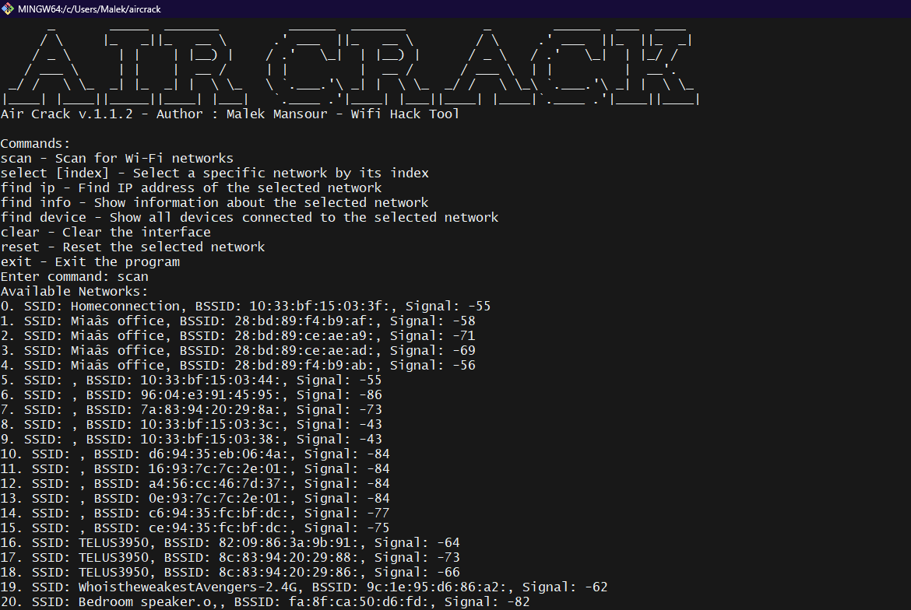

# Air Crack v.1.1.2 - Wi-Fi Hack Tool

## Description

Air Crack is a Wi-Fi hacking tool that allows users to scan for available Wi-Fi networks, select a network, and gather detailed information about the selected network. Additionally, it can find the default gateway IP address and scan for devices connected to the local network.




## Features

- Scan for available Wi-Fi networks
- Select a specific Wi-Fi network by its index
- Display detailed information about the selected network
- Find the default gateway IP address of the selected network
- Scan for devices connected to the selected network
- Clear the interface
- Reset the selected network

## In The Future
I am planning to add an actual 'Crack' function later on in the software. For now, scanning nearby wifis is all it can do.

## Requirements

- Python 3.x
- `pywifi` library
- `nmap` library

## Installation

1. Clone the repository:
   ```bash
   git clone https://github.com/yourusername/air-crack.git
   cd AirCrack
2. Install the required Python libraries:
    ```bash
    pip install pywifi python-nmap

## Usage
   ```bash
    python aircrack.py
